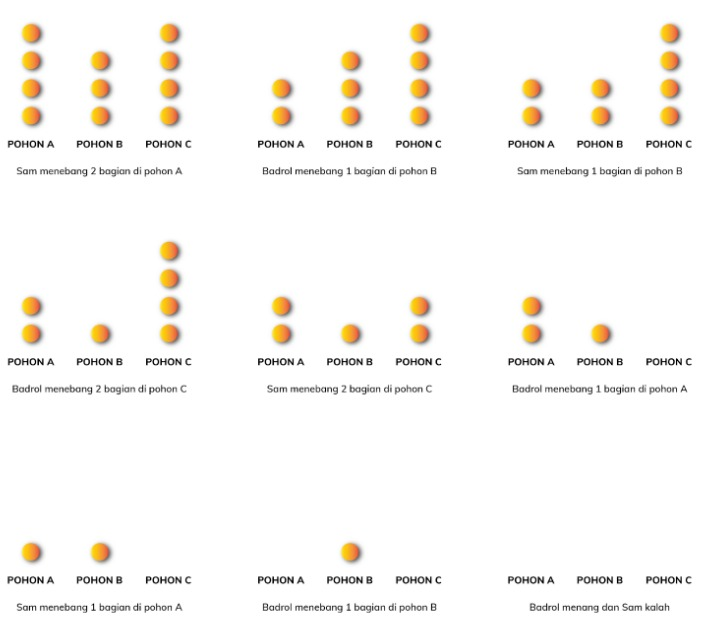

# Game Badrol & Sam: Mencari Duren di Kebun Tok Dalang :deciduous_tree:
## Overview :sun_with_face:
Game ini adalah game kompetitif dengan menggunakan konsep dari impartial game. Impartial game adalah suatu game yang dimainkan oleh dua orang di mana setiap orang akan bermain secara bergantian dan setiap gerakan yang dilakukan pada suatu giliran tidak dipengaruhi oleh giliran siapa saat itu. 

Klik link ini untuk belajar lebih lanjut mengenai impartial game:
[Impartial game](https://en.wikipedia.org/wiki/Impartial_game)

Dalam game ini akan terdapat dua tingkat kesulitan, yaitu mudah dan susah. Perbedaan dari permainan mudah dan susah terdapat pada bagaimana cara komputer (CPU) dalam memilih pohon yang akan ditebang selanjutnya. Dalam tingkat kesulitan mudan, komputer akan mencoba menebang pohon secara random (acak) sedangkan pada tingkat kesulitan susah, komputer akan menebang pohon se-optimal mungkin. Tingkat kesulitan susah sudah didesain sedemikian rupa agar pemain pasti dapat menang dengan bermain optimal. Coba kalahkah komputernya~

## Orientasi :milky_way:
Badrol adalh cucu dari Tok Dalang yang hidup di kota bersama temannya Sam. Suatu hari, Badrol dan Sam yang sedang libur semester memutuskan untuk berkunjung ke rumah Tok Dalang sebagai destinasi liburan mereka. Setelah melewati perjalanan yang panjang, mereka berdua sampai di Kampung Durian Runtuh tempat Tok Dalang tinggal. Mereka pun langsung bergegas menuju rumah Tok Dalang.

Setelah beristirahat di rumah Tok Dalang, keesokan harinya mereka di ajak Tok Dalang untuk ikut ke kebun durian miliknya. Tanpa pikir panjang, mereka pun setuju dan pergi ke sana. Sesampainya disana, mereka berdua ingin segera merasakan lezatnya durian Tok Dalang yang katanya paling enak se-Malaysia. Akan tetapi, Tok Dalang mengatakan kepada mereka untuk menunggu buah duriannya jatuh baru bisa memakannya.

Satu jam berlalu, tak satu durian pun jatuh. Badrol dan Sam merasa bosan menunggu. Akhirnya, mereka memutuskan untuk main kasar dengan menebang pohon durian Tok Dalang. Saat Tok dalang pergi kembali ke rumahnya untuk mengambil beberapa karung pupuk, mereka mengambil kapak dan langsung pergi mencari pohon durian. 

Badrol dan Sam akhirnya bertemu dengan tiga pohon durian yang terlihat agak tua dan berbuah banyak. Tanpa pikir panjang, mereka pun mencoba menebang pohon durian itu. Ajaibnya, setiap pohon yang ditebang bisa langsung berdiri tegak dan tidak menggugurkan buah duriannya sama sekali. Kapak yang mereka ambil hanya ada satu di kebun tersebut. Oleh karena itu, mereka memutuskan untuk bergantian menebang hingga seluruh pohon habis tanpa sisa. 

Saat asyik menebang, terdengar suara motor Tok Dalang dari kejauhan. Mereka tahu bahwa waktu mereka tidak banyak untuk menebang pohon durian ini. Mereka pun menebang lebih cepat sehingga tidak ketahuan Tok Dalang. Apabila ketahuan Tok Dalang menebang pohon durian miliknya, maka yang memegang kapak akan kena hukum untuk membantu menyerut kelapa 100 biji karena Opah memesan dodol untuk hajatan Upin dan Ipin yang akhirnya lulus TK.

## Cara bermain :surfer:
1. Terdapat 3 pohon durian yang dapat ditebang.
2. Pemain melakukan penebangan pohon secara bergantian.
3. Setiap menebang pohon, hanya dapat menebang 1 atau 2 satuan tinggi dari pohon tersebut.
4. Pemain yang terakhir menebang pohon dinyatakan sebagai pemenang dari game ini.

Contoh:

## Penulis Kode Sumber
1. Muhammad Julian Firdaus :boy:
2. Nisa Wahidatul Hidayah :girl:
3. Syifa Novdhy Salsabila :girl:
4. Yulinda Agrestina :girl:

## Referensi
[https://en.wikipedia.org](https://en.wikipedia.org/)

[https://www.geeksforgeeks.org](https://www.geeksforgeeks.org/)

[https://wiki.freepascal.org/](https://wiki.freepascal.org/)

---
# **SELAMAT BERMAIN**
